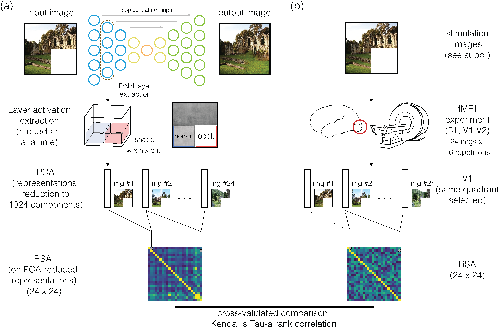
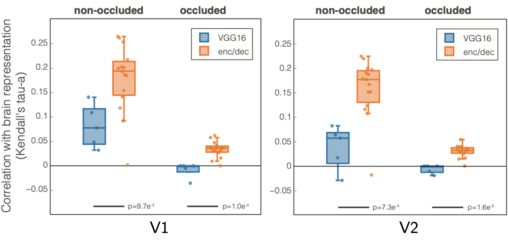
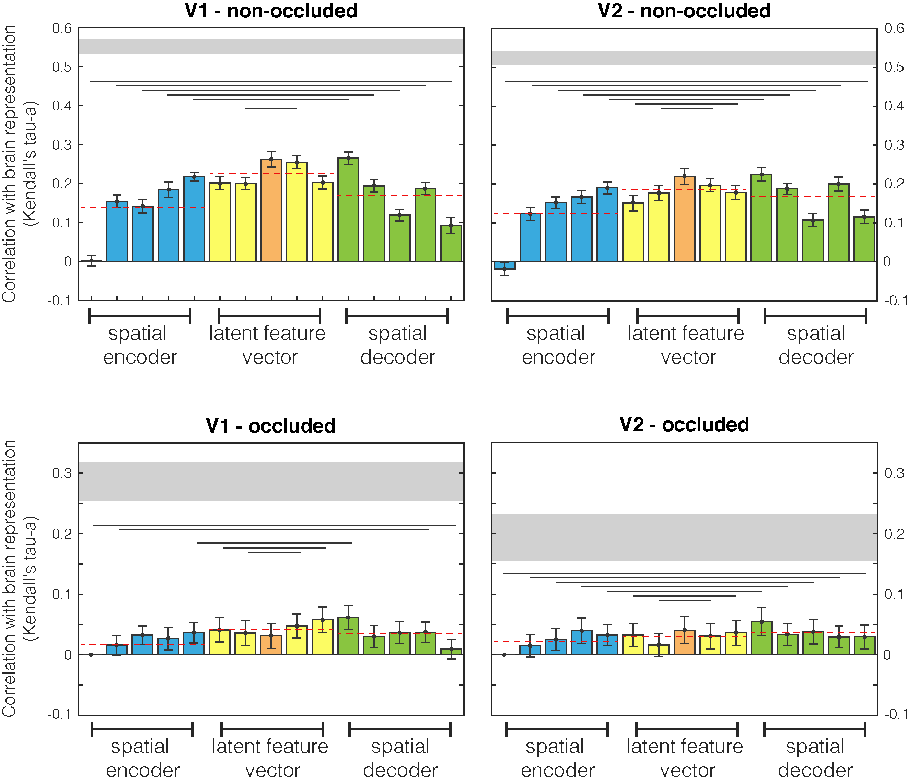
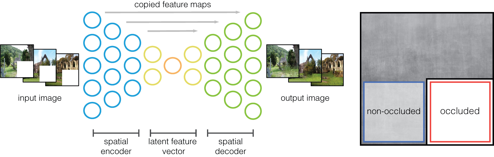
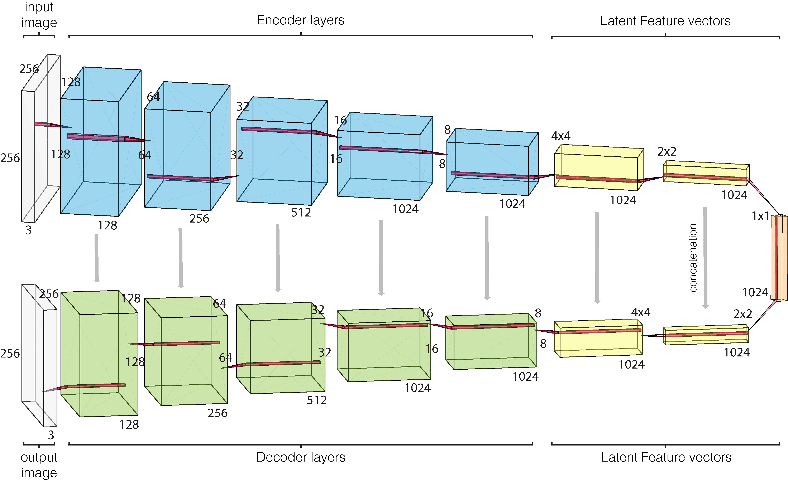
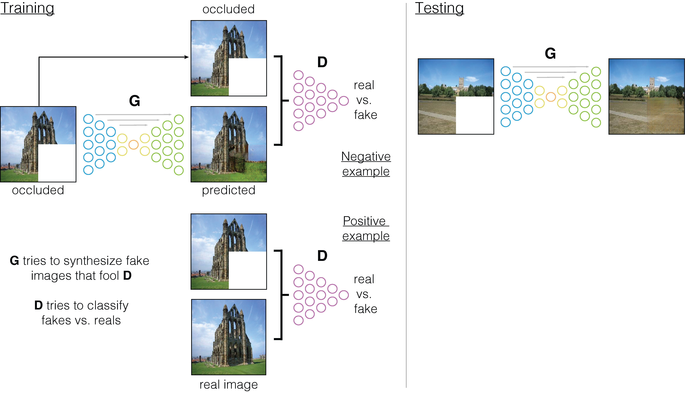
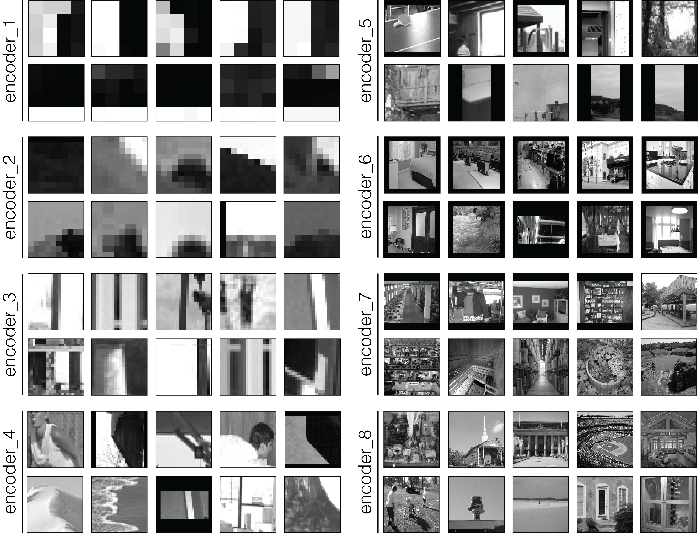

<p align="center">
  
</p>


<hr>
# Abstract

The promise of artificial intelligence in understanding biological vision relies on the comparison of computational models with brain data with the goal of capturing functional principles of visual information processing. 
Convolutional neural networks (CNN) have successfully matched the transformations in hierarchical processing occurring along the brain's feedforward visual pathway extending into ventral temporal cortex. 
However, we are still to learn if CNNs can successfully describe feedback processes in early visual cortex. 
Here, we investigated similarities between human early visual cortex and a CNN with encoder/decoder architecture, trained with self-supervised learning to fill occlusions and reconstruct an unseen image. 
Using Representational Similarity Analysis (RSA), we compared 3T fMRI data from a non-stimulated patch of early visual cortex in human participants viewing partially occluded images, with the different CNN layer activations from the same images. 
Results show that our self-supervised image-completion network outperforms a classical object-recognition supervised network (VGG16) in terms of similarity to fMRI data. 
This provides additional evidence that optimal models of the visual system might come from less feedforward architectures trained with less supervision. We also find that CNN decoder pathway activations are more similar to brain processing compared to encoder activations, suggesting an integration of mid- and low/middle-level features in early visual cortex. 
Challenging an AI model to learn natural image representations via self-supervised learning and comparing them with brain data can help us to constrain our understanding of information processing such as neuronal predictive coding.


<p align="center">
  
</p>

<hr>
# Results

## Comparison between VGG16 and encoder/decoder

<p align="center">
  
</p>

Kendall's Tau-a rank correlation between VGG16 (blue) and our model (orange) with visual areas (a) V1 and (b) V2. Every dot is a CNN layer (5 conv for VGG16 and 15 for encoder/decoder); results are averaged across subjects. We performed a t-test to determine statistical significance of the difference between the models; results are reported below the bars.

## Encoder/decoder layers detail

Comparison between brain and encoder/decoder network RDMs.
First and second columns are different human visual areas, V1 and V2 respectively.
First and second rows relate to non-occluded and occluded quadrants.
Results are highlighted with different colours for spatial encoder, latent features, and spatial decoder network sections.
Dashed red lines are mean values for the three sections.
Lines below bars show when the encoder and decoder populations difference is significant (Wilcoxon signed rank test).
Grey horizontal shaded region indicates the upper and lower bounds of the noise ceiling i.e., the maximum correlation possible within this dataset.

<p align="center">
  
</p>

<hr>
# Network

Our self-supervised image-to-image model is trained to reconstruct the occluded image section (always the lower-right quadrant); it is a fully-convolutional neural network, with an encoder/decoder architecture and with skip connections. Details on layer activation dimensions are shown in Figure below. Every layer implements the same components: a 2-D convolution with a 3 × 3 filter and stride= 2 (that downsamples the activations, no pooling used), batch normalisation, and a rectified linear unit (ReLu) function for encoder and a leaky ReLu for decoder.

<p align="center">
  
</p>

<p align="center">
  
</p>

Model architecture with layer dimensions. Every layer implements: convolution, batch normalisation, and activation function (leaky relu for encoder and relu for decoder).

## Training and testing procedure

Training and testing procedures of the model. Deliberately inspired by Fig.2 of [Isola et al., 2017].

<p align="center">
  
</p>

## Visual results

Model results with the input to the network (occluded images), the original image (i.e., shown here only for graphical comparisons of input and output with the original image), and the output of the network. Images used in this figure were not part of the training set.

<p align="center">
  
</p>


## Layer inspection

Image patches obtained for the encoder stream of our network: for every layer of the encoder, two channels are displayed.

<p align="center">
  
</p>

<hr>
# Code

Visit the Github [page](https://github.com/rockNroll87q/self-supervised_inpainting/tree/main) for the source code.

<hr>
# Data

Our fMRI dataset was collected previously and published in [Morgan et al., 2019].
Data available under EBRAINS knowledge graph at this 
[page](https://search.kg.ebrains.eu/instances/Dataset/c2df7995-f156-4953-bed1-fb4a003b364e).


<hr>
# Citation

If you find this work useful, please consider citing our paper:

```
@article {Svanera2020.03.24.005132,
	author = {Svanera, Michele and Morgan, Andrew T. and Petro, Lucy S. and Muckli, Lars},
	title = {A Self-Supervised Deep Neural Network for Image Completion Resembles Early Visual Cortex fMRI Activity Patterns for Occluded Scenes},
	year = {2020},
	doi = {10.1101/2020.03.24.005132},
	URL = {https://www.biorxiv.org/content/early/2020/12/13/2020.03.24.005132},
	journal = {bioRxiv}
}
```


<hr>
# Acknowledgments

This project has received funding from the European Union's Horizon 2020 Framework Programme for Research and Innovation under the Specific Grant Agreement No. 720270 and 785907 (Human Brain Project SGA1 and SGA2).


<hr>

