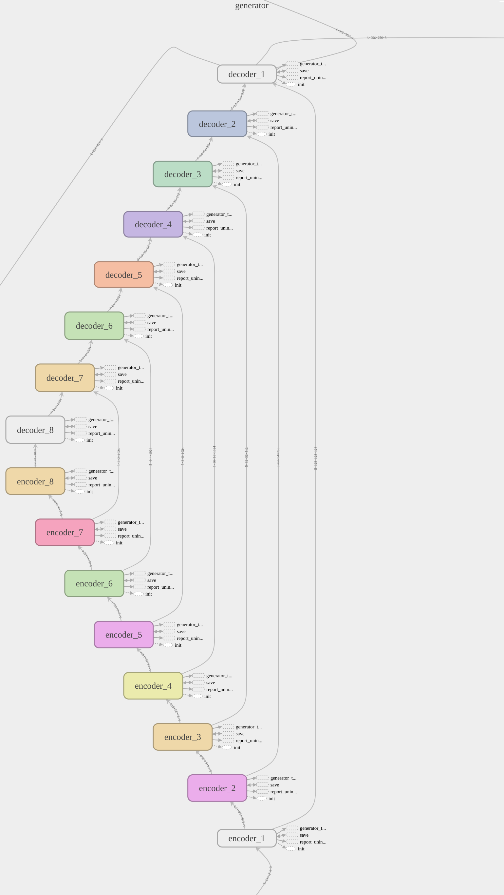
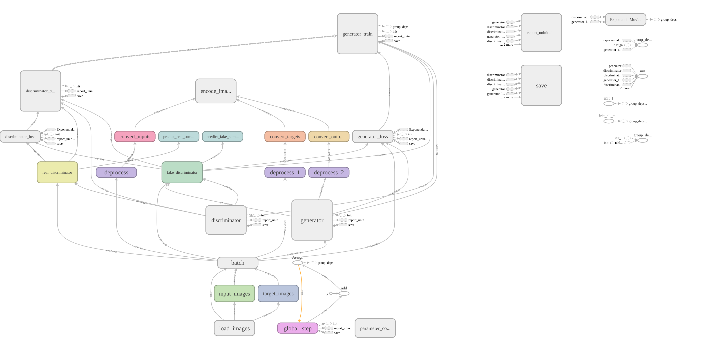

# Encoder decoder architecture for Image Completion

Description of the code used in the paper: 

> Svanera, M., Morgan, A. T., Petro, L. S., & Muckli, L. (2020). A Self-Supervised Deep Neural Network for Image Completion Resembles Early Visual Cortex fMRI Activity Patterns for Occluded Scenes. *bioRxiv.* ([link](https://www.biorxiv.org/content/10.1101/2020.03.24.005132v2.abstract))


### Encoder/decoder detail

<p align="center">
<kbd>
  
</kbd>
</p>

Layer shapes:

~~~
(batch_size, 256, 256, 3) 		# input image
(batch_size, 128, 128, 128)
(batch_size, 64, 64, 256)
(batch_size, 32, 32, 512)
(batch_size, 16, 16, 1024)
(batch_size, 8, 8, 1024)
(batch_size, 4, 4, 1024)
(batch_size, 2, 2, 1024)
(batch_size, 1, 1, 1024)
(batch_size, 2, 2, 1024)
(batch_size, 4, 4, 1024)
(batch_size, 8, 8, 1024)
(batch_size, 16, 16, 1024)
(batch_size, 32, 32, 512)
(batch_size, 64, 64, 256)
(batch_size, 128, 128, 128)
(batch_size, 256, 256, 3) 		# output image
~~~

### Training procedure

<p align="center">
<kbd>
  
</kbd>
</p>


## Requirements

`Tensorflow 1.x`


## Usage

To train the model:

~~~~
python enc_dec_activExtract.py \
  --mode train \
  --output_dir /path/where/model/is/saved/ \
  --max_epochs 10 \
  --ngf=128 --ndf=128 \
  --input_dir /path/to/training/imgs/ \
  --which_direction BtoA \
  --batch_size 10 \
  --out_activations_path /path/to/activations/folder/ \
  --gpu_device 0
~~~~

To test the model and save activations:

~~~~
python enc_dec_activExtract.py \
  --mode test \
  --output_dir /path/to/save/dir/ \
  --input_dir /path/to/testing/imgs/ \
  --out_activations_path /path/to/activations/folder/ \
  --checkpoint /path/where/model/is/saved/ \
  --gpu_device 0
~~~~


## Authors

[Michele Svanera](https://www.michelesvanera.org/)


## Citation

If you find this code useful in your research, please consider citing the original work and our paper:

```
@InProceedings{Isola_2017_CVPR,
author = {Isola, Phillip and Zhu, Jun-Yan and Zhou, Tinghui and Efros, Alexei A.},
title = {Image-To-Image Translation With Conditional Adversarial Networks},
booktitle = {The IEEE Conference on Computer Vision and Pattern Recognition (CVPR)},
month = {July},
year = {2017}
}
```

```
@article {Svanera2020.03.24.005132,
	author = {Svanera, Michele and Morgan, Andrew T. and Petro, Lucy S. and Muckli, Lars},
	title = {A Self-Supervised Deep Neural Network for Image Completion Resembles Early Visual Cortex fMRI Activity Patterns for Occluded Scenes},
	year = {2020},
	doi = {10.1101/2020.03.24.005132},
	URL = {https://www.biorxiv.org/content/early/2020/12/13/2020.03.24.005132},
	journal = {bioRxiv}
}
```
